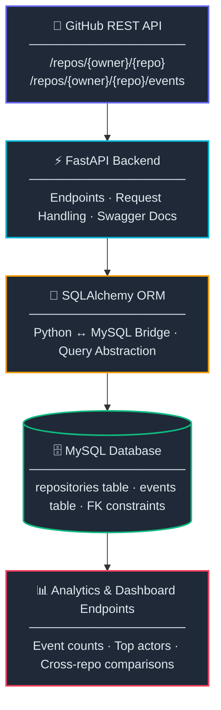

<div align="center">


<br/><br/>

# 🔭 GitHub Event Analytics Pipeline

**Ingest. Store. Analyze. — GitHub repository activity, structured for insight.**

A production-style backend service that collects repository metadata and event streams from the GitHub REST API, stores them in a relational MySQL database, and exposes a full suite of analytical REST endpoints — designed to power dashboards, reporting tools, and contributor analysis.

<br/>

</div>

---

## 📐 Architecture
 

 
---

## ✨ Features

| Feature | Description |
|---|---|
| 📥 **Data Ingestion** | Fetch and persist repo metadata + event streams from GitHub |
| 🔁 **Deduplication** | Unique `github_event_id` constraint prevents duplicate event rows |
| 📊 **Event Analytics** | Count, group, and rank events across all or individual repositories |
| 👤 **Contributor Analysis** | Identify top actors globally or per repository |
| 🗂️ **Repository Dashboard** | Single endpoint that aggregates all metadata + analytics |
| 🔗 **Cross-repo Queries** | SQL JOINs to compare activity across multiple repositories |
| 🗑️ **Safe Deletion** | Cascade-aware delete that maintains referential integrity |
| 📄 **Auto Docs** | Swagger UI auto-generated at `/docs` |

---

## 🛠️ Tech Stack

| Layer | Technology | Why |
|---|---|---|
| **Backend** | FastAPI | High performance, auto Swagger, async-ready |
| **ORM** | SQLAlchemy | Pythonic DB queries, schema management |
| **Database** | MySQL | Relational structure, FK support, aggregation queries |
| **External API** | GitHub REST API | Repository + event data source |
| **Config** | python-dotenv | Credential isolation via `.env` |

---

## 🗄️ Database Schema

### `repositories`

```sql
CREATE TABLE repositories (
    id              INT PRIMARY KEY AUTO_INCREMENT,
    github_repo_id  BIGINT UNIQUE,
    owner           VARCHAR(100),
    repo_name       VARCHAR(200),
    stars           INT,
    forks           INT,
    open_issues     INT,
    language        VARCHAR(100),
    created_at      DATETIME
);
```

### `events`

```sql
CREATE TABLE events (
    id               INT PRIMARY KEY AUTO_INCREMENT,
    repository_id    INT,
    github_event_id  VARCHAR(100) UNIQUE,   -- deduplication key
    event_type       VARCHAR(100),
    actor            VARCHAR(100),
    created_at       DATETIME,

    FOREIGN KEY (repository_id) REFERENCES repositories(id)
);
```

**Relationship:** `repositories` → `events` is **1 : N**

---

## ⚡ Quick Start

### 1. Clone the repo

```bash
git clone https://github.com/your-username/github-event-analytics.git
cd github-event-analytics
```

### 2. Create a virtual environment

```bash
python -m venv venv
source venv/bin/activate        # macOS / Linux
venv\Scripts\activate           # Windows
```

### 3. Install dependencies

```bash
pip install fastapi uvicorn sqlalchemy mysql-connector-python python-dotenv requests
```

### 4. Create the MySQL database

```sql
CREATE DATABASE github_analytics;
```

### 5. Configure `.env`

```env
DB_USER=root
DB_PASSWORD=your_password
DB_HOST=localhost
DB_NAME=github_analytics
```

### 6. Initialize tables

```python
# run once
from app.database import engine
from app.models import Base
Base.metadata.create_all(bind=engine)
```

### 7. Start the server

```bash
uvicorn app.main:app --reload
```

> 🟢 API live at `http://127.0.0.1:8000`
> 📄 Swagger docs at `http://127.0.0.1:8000/docs`

---

## 🔌 API Reference

### Data Ingestion

| Method | Endpoint | Description |
|---|---|---|
| `POST` | `/fetch-repo/{owner}/{repo}` | Fetch repo metadata from GitHub → store in DB |
| `POST` | `/fetch-events/{owner}/{repo}` | Fetch latest events from GitHub → store in DB (deduped) |

> ⚠️ Always call `/fetch-repo` before `/fetch-events` for a new repository.

---

### Analytics

| Method | Endpoint | Description |
|---|---|---|
| `GET` | `/event-count` | Total stored events (all repos) |
| `GET` | `/event-types` | Event type breakdown (all repos) |
| `GET` | `/top-actors` | Top 10 most active contributors (all repos) |
| `GET` | `/repositories/event-counts` | Per-repo event count via SQL JOIN |
| `GET` | `/most-active-repositories` | Repos ranked by activity (DESC) |

---

### Per-Repository Analytics

| Method | Endpoint | Description |
|---|---|---|
| `GET` | `/repository/{owner}/{repo}/event-types` | Event type breakdown for one repo |
| `GET` | `/repository/{owner}/{repo}/top-actors` | Top contributors for one repo |
| `GET` | `/repository/{owner}/{repo}/summary` | Stars, forks, issues, language, total events |
| `GET` | `/repository/{owner}/{repo}/dashboard` | ⭐ All of the above in one response |

---

### Management

| Method | Endpoint | Description |
|---|---|---|
| `GET` | `/repositories` | List all tracked repositories |
| `GET` | `/events` | List all stored events |
| `DELETE` | `/repository/{owner}/{repo}` | Delete repo + all its events (safe cascade) |

---

## 🔄 Typical Workflow

```bash
# 1 — Store repository metadata
POST /fetch-repo/apache/kafka

# 2 — Store events
POST /fetch-events/apache/kafka

# 3 — View full dashboard
GET /repository/apache/kafka/dashboard

# 4 — Add another repo and compare
POST /fetch-repo/pytorch/pytorch
POST /fetch-events/pytorch/pytorch
GET /most-active-repositories
```

### Dashboard Response Example

```json
{
  "repository": "apache/kafka",
  "stars": 32794,
  "forks": 16500,
  "open_issues": 210,
  "language": "Java",
  "total_events": 47,
  "event_types": [
    { "event_type": "PushEvent", "count": 20 },
    { "event_type": "PullRequestEvent", "count": 27 }
  ],
  "top_actors": [
    { "actor": "ijuma", "count": 10 },
    { "actor": "dajac", "count": 8 }
  ]
}
```

---

## 📁 Project Structure

```
github-event-analytics/
│
├── app/
│   ├── main.py              # FastAPI app + router registration
│   ├── database.py          # Engine, SessionLocal, Base, get_db()
│   ├── models.py            # Repository + Event ORM models
│   ├── schemas.py           # Pydantic schemas (request/response)
│   ├── routes.py            # All endpoint definitions
│   └── github_fetcher.py    # GitHub REST API integration
│
├── .env                     # DB credentials (not committed)
├── .gitignore
├── requirements.txt
└── README.md
```

---

## ⚠️ Current Limitations & Roadmap

| Limitation | Planned Solution |
|---|---|
| Events must be fetched manually | Scheduled polling via **APScheduler** / **Celery** |
| Unauthenticated GitHub API (60 req/hr) | Add `GITHUB_TOKEN` support for 5,000 req/hr |
| No time-range filtering on analytics | Add `?from=` and `?to=` query params |
| No pagination on event lists | Implement cursor/offset pagination |
| No frontend included | Connect a React dashboard to `/dashboard` endpoint |

---

## 💡 Concepts Demonstrated

```
REST API Design      →   FastAPI endpoints, HTTP verbs, path/query params
Database Design      →   Relational schema, foreign keys, unique constraints
ORM Usage            →   SQLAlchemy models, sessions, query chaining
Data Ingestion       →   Fetch → Deduplicate → Transform → Store
SQL Analytics        →   COUNT, GROUP BY, ORDER BY, JOIN
External API         →   GitHub REST API integration
Config Management    →   python-dotenv, environment variable isolation
CRUD + Integrity     →   Create, Read, Delete with referential safety
```

---

## 📄 License

MIT © [Your Name](https://github.com/your-username)

---

<div align="center">
  <sub>Built with FastAPI · SQLAlchemy · MySQL · GitHub REST API</sub>
</div>